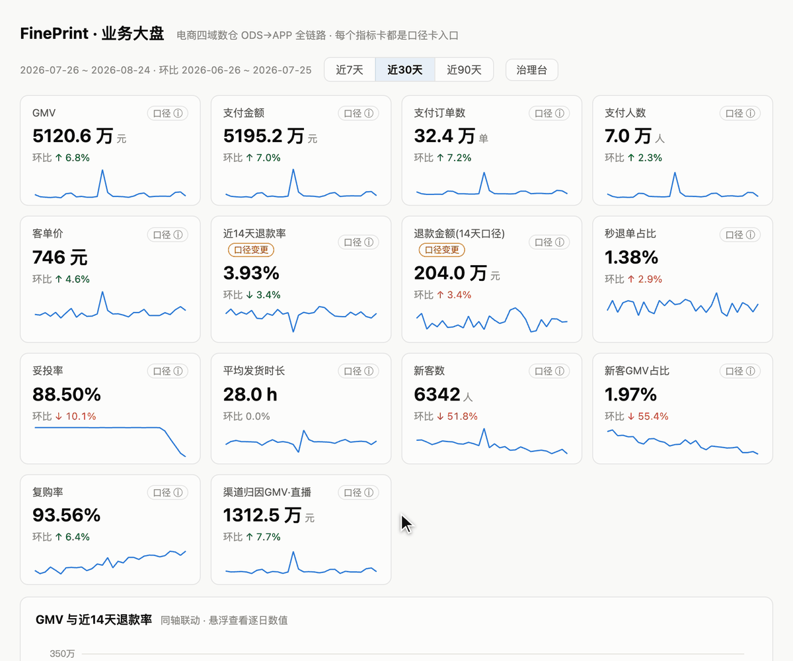

# FinePrint

**English** | [中文](README.zh.md)


**Read the fine print of your metrics. A decompiler for your dashboards.**

Ask your dashboard what a metric *actually* means.

FinePrint reverse-engineers the business & technical definition ("caliber") of every dashboard metric from the SQL that already exists in your dbt project — no upfront semantic-layer registration, no manual documentation. It answers questions like:

> *"Does this refund rate count refunds forever, or only within 14 days of payment?"*
> *"Is GMV here net of instant refunds? Which layer excludes test accounts?"*

…by reading your multi-layer pipeline the way a careful analyst would, then proving its answers.



*Every metric card carries a caliber entry: one click opens the full caliber card — business clauses each pinned to numbered evidence, the machine-proven formula, the lineage canvas, and the metric's change history. (Demo dashboard; sample data is Chinese.)*

## How it works

Two independent channels, machine-cross-validated:

```
                      ┌─ Channel 1: deterministic column-level lineage ─┐
dbt artifacts ──────► │  sources / filters / expression chain (sqlglot) │ ──┐
(manifest, catalog,   └─────────────────────────────────────────────────┘   ├─► cross-validation
 compiled SQL)        ┌─ Channel 2: LLM reads each model's SQL ──────────┐  │   → confidence grade
                ────► │  verbatim quotes, machine-verified against source│ ──┘   → evidence-bound
                      └─────────────────────────────────────────────────┘        caliber cards
```

- **Channel 1** traces every metric column back to source tables: source columns, every filter that shapes the row set (WHERE / JOIN ON / QUALIFY / HAVING, with scope analysis), window-dedup idioms, CASE WHEN attribution, COALESCE fallbacks, stat-date assignment — all with file/line anchors.
- **Channel 2** has an LLM read each model's SQL independently. Every claimed filter must carry a **verbatim quote** that is machine-checked against the source — fabricated citations are structurally impossible.
- The two channels are fingerprint-matched condition by condition. Only cross-validated filters enter the merged technical caliber. Business clauses must cite numbered deterministic evidence (`E`/`S`/`X`/`Q` ids); an unbound clause — or an empty clause list — caps the card's confidence. (The one-line definition and caveats are LLM prose over that evidence, not themselves machine-verified.)
- **Deterministic formula composer** (0.8): a third writer expands each metric's compiled SQL scope by scope into a provable formula — named sub-expressions at aggregation/window boundaries carry their defining grain, UNION branches and PIVOT columns expand deterministically, and the result must round-trip against channel 1's leaf sources plus the same lexicon/anchor validators the LLM faces. **The composer is the publishing authority for formulas; the LLM explains and narrates, and backstops only where the composer cannot prove** (multi-target combinations, scalar subqueries — each refusal carries a named machine reason). Calibrated on five public corpora across three dialects (Fivetran ad_reporting / postgres, Snowplow web / snowflake, Cal-ITP warehouse / bigquery, Mattermost analytics & snowflake-dbt / snowflake — the latter three are real production warehouses): **34,405 of 34,499 real-world columns (99.7%) composed and proven**, every residual named.
- Low-confidence cards go to a review queue instead of being published. Batches publish atomically — consumers never see a half-updated state.

Beyond caliber cards, the same lineage powers drift detection:

- **`fineprint drift`** — snapshots each metric's caliber (sources / condition fingerprints / semantics / expressions) and diffs across rebuilds: a 14→15-day window change surfaces as a `high` drift event on exactly the affected metrics.

**Roadmap** (prototyped in this repo, not part of the PyPI distribution; see [docs/stability.md](docs/stability.md)):

- **2.0 — `fineprint govern`**, duplicate-metric governance: a fingerprint scan finds duplicated metric materializations across tables (same sources + same conditions), and an LLM arbitrates same-fingerprint pairs with different names ("count vs. ratio → distinct").
- **2.0 — dbt exposures integration**: auto-discovered metric candidates pre-filled into `fineprint.yml`, and dashboard consumers annotated onto cards, drift alerts and governance weighting.
- Non-dbt SQL pipelines (see [Status & scope](#status--scope)).

## Quickstart

**No dbt project handy? Start with the bundled example** — pre-built dbt
artifacts and a card batch included; no dbt install, no database, no LLM key:

```bash
# Python 3.10+
pip install fineprint
fineprint init --demo && cd fineprint-quickstart

fineprint graph                                # column-level lineage (zero LLM)
fineprint trace dm_refund_rate_1d.refund_rate  # the fine print of one metric
fineprint report                               # caliber cards — a batch ships with the demo
```

The same example lives at [`examples/quickstart/`](examples/quickstart/) with a
10-minute walkthrough (including the caliber-drift experiment).

**On your own dbt project:**

```bash
# Python 3.10+
pip install fineprint       # from PyPI — import name and CLI are both `fineprint`
pip install -e .            # or from source, core CLI only
pip install -e ".[demo,dev]"   # + benchmark warehouse / dashboard / test deps

cd your-dbt-project
dbt compile && dbt docs generate    # FinePrint reads artifacts only — no DB connection

fineprint init             # writes fineprint.yml — list your dashboard metrics (model.column;
                            # package.model.column when two packages share a model name)
fineprint graph            # build the column-level lineage graph
fineprint columns refund   # discover traceable model.column candidates (zero LLM)
fineprint trace mart_orders.refund_rate_14d    # caliber tree for one metric (--full adds receipts)

export FINEPRINT_LLM_API_KEY=sk-...            # any OpenAI-compatible endpoint
export FINEPRINT_LLM_MODEL=deepseek-chat       # or gpt-4.1-mini, etc.
fineprint synth            # synthesize caliber cards (cached, atomic batch publish)
fineprint report           # export a self-contained HTML caliber report

fineprint drift            # caliber drift check (--strict = CI gate: high drift
                            #   exits 1 and leaves baseline + log untouched)
```

Notebooks, BI plugins and orchestration hooks use the Python API — the minimal
public surface since 0.9 (see [docs/stability.md](docs/stability.md)):

```python
import fineprint
fineprint.build_graph("path/to/dbt_project")             # lineage graph (zero LLM)
print(fineprint.trace("path/to/dbt_project", "dm.gmv"))  # caliber tree (zero LLM)
batch = fineprint.cards("path/to/dbt_project")           # published caliber cards
batch["gmv"]["technical_facts"]["formula"]               # the card JSON is the contract (schema_version frozen)
```

Configuration lives in `fineprint.yml` (metrics list, language `zh|en`, lexicon). The `language` setting drives both card content and the CLI's own output (`FINEPRINT_LANG` overrides). LLM credentials are env-vars only (`.env` in the project root is honored): `FINEPRINT_LLM_BASE_URL / _API_KEY / _MODEL / _FAST_MODEL / _QUALITY_MODEL`, plus tuning knobs `_CONCURRENCY / _TIMEOUT / _RETRIES`.

### Upgrading from ≤0.8.3 (`metriclens`)

0.8.4 unified every name to `fineprint` in one clean break — same PyPI package, no compat shims. Migration is four renames; no format changed:

| before | after |
|---|---|
| `metriclens` CLI · `import metriclens` | `fineprint` · `import fineprint` |
| `metriclens.yml` | `fineprint.yml` — `mv metriclens.yml fineprint.yml` |
| `.metriclens/` workspace | `.fineprint/` — `mv .metriclens .fineprint` keeps the LLM cache, card batches and drift history |
| `METRICLENS_*` env / `.env` keys | `FINEPRINT_*` (values unchanged) |

Since 0.8.9 the CLI detects leftovers — a legacy config file, workspace directory, or `METRICLENS_*` keys — and prints the exact rename instead of a bare "not found".

**Third-party dbt packages** (Fivetran connectors, shared vendor models, …) are treated as **data-source boundaries**, the same convention as ODS tables: their SQL, docs and internal calibers are not parsed — lineage stops at their materialized tables, which appear on cards tagged with the owning package. You govern *your* code; theirs is upstream infrastructure. To see through an internal shared package you do own, list it under a top-level `internal_packages: [shared_models]` in `fineprint.yml` and rebuild the graph.

Everything FinePrint produces lives under `your-dbt-project/.fineprint/` — graph, caliber card batches (with an atomic `active_run` pointer), snapshots, drift log, LLM cache.

## The 14-trap benchmark

This repo includes a fully reproducible benchmark warehouse (`warehouse/`): a simulated 4-domain e-commerce business (90 days, ~1.1M orders, fixed seed) whose dbt models embed **14 realistic caliber traps** — a 14-day refund window buried in an intermediate CASE WHEN, GMV net of 60-second flash refunds, binlog multi-version dedup, delayed live-stream attribution, SCD2 exchange rates, duplicated refund metrics across domains, and more. Every trap is verifiable in data, and ground truth is machine-checkable:

```bash
bash jobs/rebuild.sh        # simulate → dbt build (28 tests) → trap validation →
                            # independent hand-check → lineage golden set (100% P/R target)
bash jobs/caliber_refresh.sh   # synth + trap-revelation eval (14/14 on current runs)
```

We believe this is the first ground-truthed benchmark for *metric-definition extraction from SQL pipelines* — if you're evaluating any "AI documentation" tool, it will happily stress-test that too.

## Documentation

- [Architecture](docs/architecture.md) — the two channels, the formula composer, the publication state machine
- [Accuracy](docs/accuracy.md) — the five-project probe (34,499 columns) and the 14-trap suite
- [Privacy & data boundaries](docs/privacy.md) — what is read, what is sent to the LLM, what never leaves
- [Configuration reference](docs/configuration.md) — every `fineprint.yml` key, environment variable and exit code
- [Python API](docs/python-api.md) — the minimal public surface (since 0.9)
- [Known boundaries](docs/known-boundaries.md) — what FinePrint knows it cannot do
- [Stability policy](docs/stability.md) — what is frozen, and when

## Status & scope

Works today: dbt projects on 12 adapters (DuckDB, Snowflake, BigQuery, Postgres, Redshift, Databricks, Spark, Trino, Athena, ClickHouse, SQL Server, MySQL) — schema comes from `catalog.json`, dialect from `manifest.json`, no warehouse connection needed. Unlisted adapters fail with a clear error rather than guessing a dialect. Parsing covers what sqlglot can qualify; dbt's compiled, single-`SELECT`-per-model world is exactly that sweet spot.

Not yet: non-dbt pipelines (stored procedures, script-generated SQL, Flink/Spark code), BI-layer lineage (dashboard field → dataset → SQL), incremental graph builds, owner sign-off workflow. (Multi-database projects and cross-package same-name models are supported since 0.7.0 — identities are dbt `unique_id` + physical three-part names.) See the roadmap in `docs/`.

### Data egress & privacy

Channel 2 sends **compiled model SQL, column descriptions from your schema.yml, your `fineprint.yml` lexicon, and metric context (titles, target columns, layer names, query filters, the deterministic evidence list, and earlier LLM extraction outputs being merged)** to the LLM endpoint you configure (`FINEPRINT_LLM_BASE_URL`) — never warehouse data or credentials. If your SQL is sensitive, point it at a self-hosted or VPC endpoint; Channel 1 (lineage, drift, fingerprint scan) runs fully offline. LLM responses are cached content-addressed under `.fineprint/cache/` in your project — treat that directory as containing your SQL. Third-party dbt package SQL and docs never reach the LLM at all (data-source boundary, see above); SQL comments in your own models remain untrusted input to the LLM. Machine checks bound what a prompt-injected model can smuggle into a published card — verbatim quotes, evidence-bound clauses, and a channel-1 lexicon/aggregation screen over free-text fields all cap confidence on mismatch — but the prose wording itself is still LLM output and is not proven correct, so review cards from untrusted model code before publishing them to consumers.

A demo dashboard (FastAPI + React) that renders caliber cards, drift badges, a governance console and a lineage canvas against the benchmark warehouse lives in `server/` + `dashboard/`.

## License

Apache-2.0
