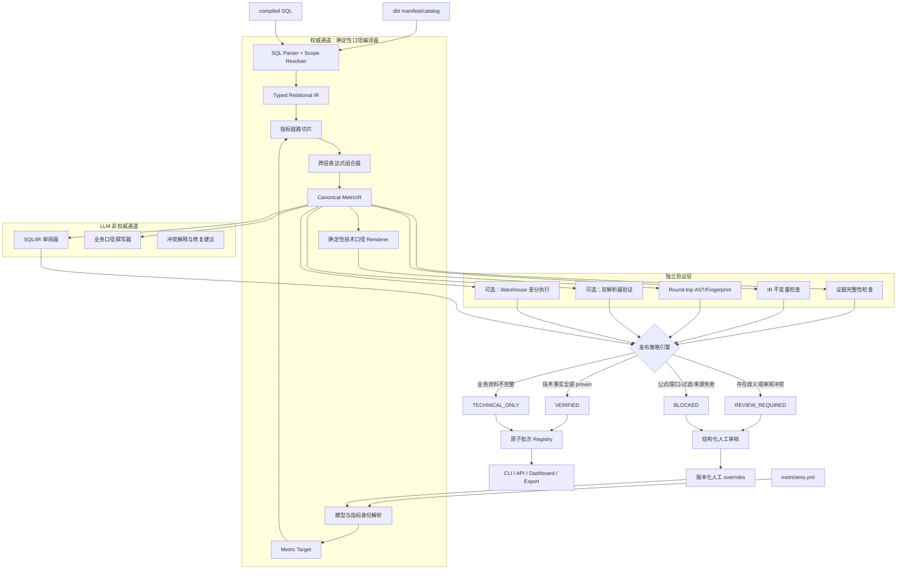

# MetricLens v1.0 技术方案（GPT 设计稿）

> 文档标识：GPT Design Proposal  
> 目标版本：MetricLens 1.0  
> 基线版本：0.7.0  
> 状态：方案设计，待评审与分阶段实施  
> 适用范围：基于 dbt artifacts 与 compiled SQL 的指标技术口径编译、解释、验证和发布

## 1. 背景

MetricLens 0.7 已具备以下基础能力：

- 从 dbt `manifest.json`、`catalog.json` 和 compiled SQL 构建字段级血缘图；
- 使用 dbt `unique_id` 作为逻辑身份，并以 `database.schema.table` 作为物理反查身份；
- 回溯源字段、过滤条件、表达式链和结构语义；
- 使用 LLM 逐跳阅读 SQL，并与确定性血缘结果进行互验；
- 生成技术口径、业务口径和编号证据；
- 提供漂移检测、重复建设治理、原子批次发布和审核状态；
- 支持多个 dbt adapter 方言，并对第三方 dbt package 设置数据源边界。

0.7 的主要问题不在于缺少更多评分规则，而在于权威事实的生产方式：最终完整技术口径仍由 LLM 对逐跳结果进行归并生成。现有机器校验可以发现部分错误，但不能证明最终 `formula`、`window`、`special`、`key_filters` 和 `summary` 与原始 SQL 端到端等价。

当前置信度也同时承担了“结果质量”“证据完整性”“LLM 一致性”和“是否可以发布”多种语义。部分检查失败只会将 `high` 降为 `medium`，而 `medium` 仍可作为 `published` 卡片展示，无法满足稳定版对关键技术事实的 fail-closed 要求。

## 2. 设计结论

MetricLens 1.0 应从“LLM 生成口径并由规则打分”升级为：

> **确定性技术口径编译器 + 可证明的 MetricIR + 独立验证层 + LLM 辅助解释。**

核心职责重新划分：

- 编译器决定技术事实；
- Proof Graph 证明技术事实来自哪里、经过了什么组合；
- 验证器决定技术事实是否允许发布；
- LLM 负责业务化表达、复杂语义解释、独立审阅和冲突说明；
- LLM 不得直接修改权威 MetricIR，也不得成为技术公式、窗口、过滤和粒度的事实来源；
- 无法证明的关键事实必须阻断，不允许通过降低一个笼统置信度继续发布。

## 3. 目标与非目标

### 3.1 目标

1. 最终技术口径由 SQL 与配置确定性编译产生。
2. 每个技术字段都能追溯到 SQL、模型、AST/IR 节点和 artifact hash。
3. 对关键语义错误执行 fail-closed。
4. 在复杂 SQL 下同时保留机器精确性和人类可读性。
5. LLM 不可用时，技术口径仍能完整生成和验证。
6. 对 unsupported、ambiguous、contradicted 等状态提供明确失败语义。
7. 建立稳定的 v1 图、IR、卡片、验证报告和 CLI/API 契约。
8. 保留现有原子批次发布、漂移和治理能力，并使其统一绑定 MetricIR。
9. 适合作为通用开源工具扩展不同 dbt adapter、LLM provider 和可选 warehouse verifier。

### 3.2 非目标

以下能力不作为 1.0 首发的强制范围：

- 非 dbt 存储过程、脚本生成 SQL、Flink/Spark 程序血缘；
- BI Dashboard 到 Dataset/SQL 的完整反向血缘；
- 所有数据仓库都必须执行在线数据差分；
- 一任务多表或多任务写一表的平台任务血缘；
- 让 LLM 自动决定或覆盖 SQL 已表达的技术事实。

1.0 的产品边界应明确为：

> 面向 dbt compiled SQL 项目的、离线优先、可证明技术口径编译与解释工具。

## 4. 总体架构



## 5. 信任模型

### 5.1 权威输入

权威技术事实只能来自：

- dbt manifest 中的节点、依赖、compiled path 和 unique_id；
- catalog 中的物理 relation 和列信息；
- compiled SQL 的 AST、scope 和原文 span；
- `metriclens.yml` 中由用户显式维护的指标目标、查询层过滤和业务词典；
- 已审核、带 SQL fingerprint 的版本化 override。

schema 文档和业务词典可以为技术对象提供业务名称，但不能改变 SQL 已表达的公式、过滤、窗口、粒度或 JOIN 语义。

### 5.2 非权威输入

以下内容不得直接成为权威技术事实：

- LLM 生成的 expression、source_columns、special、summary 或 formula；
- SQL 注释中的自然语言指令；
- 第三方 package 的未授权文档；
- 未绑定 SQL fingerprint 的历史人工结论；
- 无证据的字段名、函数名或业务含义推断。

### 5.3 技术事实状态

每个事实单独记录状态：

- `proven`：由确定性编译产生且证据完整；
- `supported`：有可靠文档或配置支持，但不是 SQL 结构事实；
- `ambiguous`：存在多个合法解释；
- `unsupported`：解析器无法表达该构造；
- `contradicted`：不同验证通道得到冲突结果；
- `inferred`：仅由模型或启发式推断，不允许进入权威技术口径。

不得使用一个全局 `high/medium/low` 覆盖所有字段状态。

## 6. 核心领域模型

### 6.1 标识模型

继续沿用 0.7 的身份原则：

- 模型逻辑身份：dbt `unique_id`；
- 物理 relation：`database.schema.identifier`；
- 列身份：`ColumnId(model_uid, column_name)`；
- source 身份：source unique_id + 物理三段 relation；
- 短名只用于 UI 展示和无歧义输入解析。

所有对象应使用强类型标识，禁止在核心逻辑中使用未经解析的字符串拼接作为身份。

### 6.2 Relational IR

每个 dbt 模型先编译为带作用域的关系 IR，至少包含：

- projection；
- filter；
- join 及 join type；
- group by 与 aggregation；
- having；
- qualify；
- window；
- union/set operation；
- CTE、subquery 和 alias scope；
- row-set dependency；
- output grain；
- source span 与解析诊断。

示意：

```python
@dataclass(frozen=True)
class RelNode:
    node_id: str
    kind: RelNodeKind
    inputs: tuple[str, ...]
    scope_id: str
    output_columns: tuple["ColumnBinding", ...]
    evidence_ids: tuple[str, ...]
    diagnostics: tuple["Diagnostic", ...]
```

### 6.3 MetricIR

MetricIR 是最终技术口径的唯一权威中间表示：

```python
@dataclass(frozen=True)
class MetricIR:
    schema_version: str
    metric_id: str
    target: ColumnId
    value: ExprNode
    aggregation: AggregationSpec | None
    grain: tuple[ColumnId, ...]
    filters: tuple[PredicateIR, ...]
    joins: tuple[JoinIR, ...]
    time_semantics: TimeSemantics | None
    window: WindowSpec | None
    null_handling: tuple[NullRule, ...]
    unit: UnitSpec | None
    sources: tuple[SourceColumn, ...]
    evidence: dict[str, EvidenceRef]
    proof: ProofGraph
    diagnostics: tuple[Diagnostic, ...]
    graph_hash: str
    config_hash: str
```

必须结构化表达：

- `sum`、`count`、`count distinct`、`avg` 等聚合；
- numerator 与 denominator；
- GROUP BY 粒度；
- WHERE、JOIN ON、HAVING、QUALIFY 的作用域；
- 窗口分区、排序、边界和去重规则；
- 统计日期、事件日期、业务日期及归属规则；
- CASE WHEN 归因；
- COALESCE 和 NULL 处理；
- 币种、比例、单位换算；
- row-count 与 join fan-out 风险；
- 物理源表、源字段和外部 package 边界；
- 所有关键节点的 SQL span 和证据。

### 6.4 表达式 DAG

跨层表达式不得粗暴展开为一个超长字符串，应保存为 DAG：

```python
@dataclass(frozen=True)
class ExprNode:
    node_id: str
    operator: str
    operands: tuple[str, ...]
    data_type: str | None
    nullable: bool | None
    evidence_ids: tuple[str, ...]
```

Renderer 可以将复杂表达式输出为具名子表达式：

```text
有效订单额 := SUM(CASE WHEN valid_order THEN amount_cny ELSE 0 END)
有效订单数 := COUNT(DISTINCT CASE WHEN valid_order THEN order_id END)
客单价 := 有效订单额 / NULLIF(有效订单数, 0)
```

既避免上下文爆炸，也保持端到端证明链。

### 6.5 EvidenceRef

每条证据至少包含：

```python
@dataclass(frozen=True)
class EvidenceRef:
    evidence_id: str
    kind: str
    model_uid: str
    compiled_path: str
    sql_hash: str
    start_line: int | None
    end_line: int | None
    source_text: str
    ast_node_id: str | None
```

展示摘要可以截断，但持久化证据和验证输入不得使用散落的固定长度截断。需要缩减时，应使用集中配置的分页、索引或内容寻址存储。

## 7. 确定性编译流程

### 7.1 Artifact 装载

1. 校验 manifest/catalog schema 和 dbt project identity。
2. 建立 unique_id 与物理 relation 双向索引。
3. 校验物理 relation 唯一性。
4. 为每个 compiled SQL 计算内容 hash。
5. 记录 adapter、dialect、dbt 版本和生成时间。

### 7.2 SQL 解析与作用域解析

每个一方模型执行：

1. 使用 adapter 对应方言解析 SQL；
2. 建立 CTE、subquery、alias 的独立 scope；
3. 展开 `*` 和限定列；
4. 解析 projection、filter、join、aggregate、window 和 set operation；
5. 将每个 IR 节点绑定原文 span；
6. 对无法解析的构造产生结构化 `Diagnostic`；
7. unsupported 构造如果位于目标值链或口径条件链上，则标记为 material。

### 7.3 指标链路切片

从 target 与 extra_targets 出发构建最小相关子图：

- 值依赖；
- 行集依赖；
- 条件依赖；
- 窗口与去重依赖；
- 聚合和 grain 依赖；
- JOIN 基数风险依赖；
- 时间和单位依赖。

不在指标切片内的 SQL 不应污染口径；无法归因到具体值路径的条件进入 `ambiguous`，不得静默合并。

### 7.4 跨层组合

跨 APP/DM/DWM/DWD/ODS 的组合过程：

1. 解析目标列表达式；
2. 沿列边替换上游引用；
3. 保留原始节点和 proof edge，不销毁分层信息；
4. 传播行集过滤和列值过滤；
5. 区分纯关联键与 JOIN ON 中的业务限定；
6. 传播 aggregate、grain、window、null、unit 和日期语义；
7. 检查外连接条件位置对语义的影响；
8. 对表达式 DAG 去重，避免重复展开；
9. 对超出能力边界的节点产生 material diagnostic；
10. 生成 Canonical MetricIR。

### 7.5 规范化

只允许明确保持语义的规范化：

- 大小写和引用符规范化；
- relation/column 完全限定；
- 安全括号消除；
- 明确可交换运算的排序；
- 完全等价条件去重；
- CTE 与 alias 身份展开；
- `count(*)`、`count(1)`、`sum(1)` 等受控等价类；
- `avg(x)` 与 `sum(x)/count(x)` 的受控表达，但必须保留 NULL 语义检查。

不得激进改写：

- NULL 相关表达式；
- 浮点运算顺序；
- LEFT/RIGHT/FULL JOIN；
- 窗口函数；
- 非确定性函数；
- 方言特有 UDF；
- 可能改变溢出、精度或类型提升的表达式。

## 8. 技术口径 Renderer

Renderer 只读取 MetricIR，不调用 LLM。输出包括：

```json
{
  "formula": {
    "rendered": "有效退款金额 / NULLIF(有效支付金额, 0)",
    "ir_node": "expr_82",
    "status": "proven",
    "evidence_ids": ["X12", "X18", "S4"]
  },
  "window": {
    "type": "rolling",
    "size": 14,
    "unit": "day",
    "date_column": "pay_time",
    "status": "proven",
    "evidence_ids": ["S7", "X21"]
  },
  "special": [],
  "key_filters": [],
  "grain": [],
  "sources": []
}
```

输出分为三层：

1. 权威机器口径：完整 MetricIR 和结构化字段；
2. 确定性可读公式：由模板和具名子表达式生成；
3. LLM 技术说明/业务说明：允许重组表达，但不能新增事实。

## 9. LLM 的新职责

### 9.1 允许职责

- 将技术事实组织成业务人员可读语言；
- 合并重复描述；
- 为复杂 IR 节点生成解释；
- 根据 schema docs 和 lexicon 翻译业务术语；
- 独立审阅 SQL 与 MetricIR，报告可能遗漏；
- 为人工审核生成结构化差异摘要和修复建议。

### 9.2 禁止职责

- 新增源字段；
- 修改聚合、DISTINCT、分子、分母；
- 修改时间窗口或日期字段；
- 修改过滤条件和作用域；
- 推断并写入无证据的业务含义；
- 直接写入或覆盖 MetricIR；
- 决定卡片是否发布。

### 9.3 Claim 协议

LLM 审阅输出应是结构化 Claim，而不是自由文本技术块：

```json
{
  "field": "window.size",
  "claim": 7,
  "verdict": "contradicted",
  "evidence": {
    "model_uid": "model.pkg.fact_orders",
    "sql_span": "rows between 13 preceding and current row"
  },
  "explanation": "SQL 表达的是包含当前日在内的 14 日窗口"
}
```

LLM 发现的新事实不能直接采用。系统必须重新触发确定性解析；如果编译器无法表达，则进入审核或形成版本化 override。

### 9.4 业务口径生成

业务口径输入仅允许包含：

- 已验证 technical；
- 编号 evidence；
- 一方 schema docs；
- 用户维护 lexicon；
- query_filter；
- 已审核 override。

每条业务 claim 必须绑定 evidence。定义和 caveat 也应从当前的词表筛查升级为 claim-level evidence binding。

## 10. 验证体系

### 10.1 证据完整性

必须验证：

- 每个 material technical 字段至少有一条有效 evidence；
- evidence 对应的 model、path、hash 和 SQL span 存在；
- graph hash、config hash 与当前运行一致；
- proof graph 中不存在悬空节点或断裂边；
- 外部 package 边界有明确标记。

### 10.2 IR 不变量

至少包含：

- 所有 ColumnId 唯一解析；
- 表达式 DAG 无循环；
- aggregate 与 grain 一致；
- numerator/denominator 类型兼容；
- window partition/order/boundary 完整；
- filter scope 与 join type 兼容；
- NULL 和类型提升规则明确；
- row-count 遇未证明基数的 JOIN 时产生 material 风险；
- 未支持节点不会被空值或默认值掩盖。

### 10.3 Round-trip 验证

Renderer 输出的机器表达式应可以重新解析为 AST/IR，并与 MetricIR root 计算规范化 fingerprint。fingerprint 不一致时直接阻断。

Round-trip 不能证明所有代数等价，但能保证 Renderer 没有在输出过程中修改结构化事实。

### 10.4 双解析器验证

为关键方言提供可选第二解析器 adapter。双解析器对以下事实交叉检查：

- source relations；
- projection dependencies；
- predicates；
- aggregate 与 distinct；
- join types；
- window specifications。

两个解析器出现 material 冲突时进入 `REVIEW_REQUIRED`，不采用多数投票。

### 10.5 可选 Warehouse 差分

当用户配置 warehouse verifier 时：

- 对原指标 SQL 与 MetricIR 编译 SQL执行受控差分；
- 比较总值、分组值、NULL 分布和行数；
- 显式配置时间范围、扫描上限和容差；
- 保存 query id、数据版本、采样/过滤策略；
- 不允许在业务代码中散落固定前 N 条或固定时间范围；
- 运行时验证失败不得覆盖静态失败，也不得被 LLM解释为通过。

## 11. 冲突处理

| 冲突类型 | 处理方式 | 发布结果 |
|---|---|---|
| LLM 表述与 MetricIR 不同，但 IR 证明完整 | 保留 IR，记录 LLM 审阅告警 | 可发布技术口径 |
| LLM 提出带 SQL 原文的新事实 | 重新执行确定性解析 | 解析完成前不采用 |
| 源字段缺失或出现链路外源字段 | material contradiction | `BLOCKED` |
| 聚合、DISTINCT、分子分母不一致 | material contradiction | `BLOCKED` |
| 时间窗口、日期字段、统计日不一致 | material contradiction | `BLOCKED` |
| 过滤、JOIN type、QUALIFY/HAVING 不一致 | material contradiction | `BLOCKED` |
| 两个解析器 material 结果不一致 | 结构化冲突 | `REVIEW_REQUIRED` |
| 业务注释缺失 | 技术事实不受影响 | `TECHNICAL_ONLY` |
| unsupported 位于指标切片之外 | 非关键告警 | 可发布 |
| unsupported 位于值链或口径条件内 | material unsupported | `BLOCKED` |
| 人工确认特殊业务语义 | 写入版本化 override 后重编译 | 重新验证 |

不存在“关键错误只从 high 降到 medium 后继续发布”的路径。

## 12. 状态机与发布策略

### 12.1 编译状态

```text
DISCOVERED
  → PARSED
  → COMPILED
  → STATIC_VERIFIED
  → RUNTIME_VERIFIED（可选）
```

### 12.2 内容状态

```text
technical_status:
  verified | review_required | blocked | stale

business_status:
  supported | draft | review_required | unavailable

publication_status:
  published | technical_only | review | blocked | stale
```

### 12.3 默认发布策略

```python
publishable = (
    technical_status == "verified"
    and all(fact.status == "proven" for fact in material_facts)
    and not material_diagnostics
)
```

允许：

- `verified + supported` → `published`；
- `verified + unavailable/draft` → `technical_only`；
- `review_required` → 只展示结构化冲突和审核状态；
- `blocked` → 不展示技术/业务正文；
- `stale` → 默认不作为当前口径消费。

不再以 `confidence in ("high", "medium")` 判断是否发布。可保留 assurance tier 作为能力标识，但不能替代状态机：

- `A1_STATIC`：静态编译与 proof 校验通过；
- `A2_DUAL_PARSER`：第二解析器验证通过；
- `A3_RUNTIME`：运行时差分验证通过。

## 13. 人工审核与 Override

### 13.1 审核单元

审核对象应是结构化冲突，而不是让审核人重新阅读整张卡：

- field path；
- 编译器结果；
- 审阅器/第二解析器结果；
- 两侧 evidence；
- severity；
- 建议处理方式。

### 13.2 CLI/API

建议增加：

```text
metriclens review list
metriclens review show <metric>
metriclens review approve <conflict-id>
metriclens review reject <conflict-id>
metriclens review override <conflict-id> --file override.yml
```

### 13.3 Override 契约

```yaml
schema_version: "1"
overrides:
  - id: refund-rate-time-basis
    metric: refund_rate
    field: time_semantics.date_column
    value: refund_completed_at
    reason: 业务按退款完成日归属
    owner: data-governance
    approved_at: 2026-08-29T10:00:00+08:00
    expires_at: 2027-01-01T00:00:00+08:00
    sql_fingerprint: sha256:...
    graph_hash: sha256:...
```

人工不能直接编辑生成后的卡片 JSON。SQL fingerprint、graph hash 或相关 evidence 改变时，override 自动失效并进入复核。

## 14. 持久化与原子发布

保留现有 `runs/<run_id>/ + active_run` 设计，同时升级为不可变运行包：

```text
.metriclens/
  graphs/<graph_hash>/
  runs/<run_id>/
    run.json
    metrics/<metric_key>/
      metric-ir.json
      technical.json
      business.json
      validation.json
      evidence.json
      review.json
    index.json
  active_run
  overrides/
  cache/
```

发布前必须校验：

- 指标集合与配置一致；
- 所有 publishable 指标完成验证；
- schema version 可识别；
- graph/config/tool/prompt hash 完整；
- 没有 material stale artifact；
- index 与文件内容 hash 一致。

并发运行应增加项目级锁或 compare-and-swap：

- 同一项目不允许两个发布者无序切换 active_run；
- 长任务支持 checkpoint 和恢复；
- 崩溃残留 run 保留排查信息但不得激活；
- active 指针损坏时返回明确错误，不静默读取未知批次。

## 15. 漂移与治理

### 15.1 漂移

漂移应比较 MetricIR，而不是仅比较字符串或离散集合：

- source identity；
- value expression fingerprint；
- aggregation/distinct；
- numerator/denominator；
- grain；
- filters 和 scope；
- join type 与基数证明；
- window/time/null/unit；
- evidence/proof 结构。

仅格式变化、别名变化和安全重排不应产生语义漂移。

### 15.2 重复建设治理

治理指纹基于 Canonical MetricIR：

- 完全相同 IR → 确定性重复；
- 同源同过滤但 aggregate/grain/value 不同 → 确定性不同指标；
- join 基数或 UDF 语义不确定 → suspected/review；
- LLM 只解释候选差异，不做最终重复裁决。

治理模块可以在 1.0 中继续标记为 experimental，避免其启发式能力与核心口径编译器共享同一稳定性承诺。

## 16. 可观测性与错误模型

每个运行阶段记录：

- run_id、metric_id、graph/config/tool version；
- 阶段状态和耗时；
- 输入模型数、SQL 字节数、IR 节点数、证据数；
- parser adapter 与 dialect；
- LLM provider/model/prompt version、tokens、耗时和重试原因；
- validation rule id、field path、severity、证据；
- 发布、跳过、审核、阻断原因；
- 缓存命中和内容 hash。

统一错误类型：

```text
ArtifactError
IdentityError
ParseError
UnsupportedSqlError
CompileError
ProofError
ValidationConflict
LLMTransportError
LLMContractError
StoreError
PublicationError
```

不得使用默认值掩盖不可恢复错误。异常信息应包含模型和阶段上下文，但不得泄露 API key 或敏感配置。

## 17. 性能与资源策略

### 17.1 避免表达式爆炸

- 使用内容寻址 Expr DAG；
- 相同子表达式只存储一次；
- 展示使用具名子表达式；
- 仅对目标指标切片执行跨层组合；
- 依据节点数和依赖深度配置资源预算；
- 超出预算时产生显式 diagnostic，不使用随意字符串截断。

### 17.2 增量能力

根据内容 hash 复用：

- 未变 compiled SQL 的 Relational IR；
- 未变上游闭包的 MetricIR；
- 未变 evidence 的 LLM 业务表达；
- 未变 MetricIR 的 drift/governance fingerprint。

如果 1.0 暂不实现完整增量建图，必须公布验证过的最大项目规模和全量构建 SLA。

### 17.3 外部调用

- LLM 调用集中在 adapter 层；
- 配置并发上限、超时、最大重试、退避和取消；
- 不在循环中无控制调用 LLM；
- 大上下文使用基于 IR/证据结构的选择与分块；
- 不允许散落固定 token 或固定前 N 条截断；
- 所有截断/分页策略必须命名、配置化并保留完整原始数据索引。

## 18. 安全与隐私

- LLM 技术解释和业务撰写均为可选能力；
- 默认可完全离线生成和验证技术口径；
- 发送 LLM 前记录字段级数据出境清单；
- 第三方 package 边界继续默认阻止其 SQL 和 docs 出境；
- SQL 注释视为 prompt injection 输入，不能改变系统策略；
- LLM 输出全部经过 schema 校验和 claim/evidence 校验；
- cache 文件权限、清理策略和敏感性在文档中明确；
- 日志不得打印凭据或完整授权头；
- artifact 和运行包使用内容 hash 检测篡改与混版本；
- 对恶意 compiled SQL、超深 AST、超大表达式和缓存污染进行安全测试。

## 19. 目标模块结构

```text
metriclens/
  domain/
    identifiers.py
    relational_ir.py
    metric_ir.py
    evidence.py
    diagnostics.py
    publication.py

  compiler/
    parser.py
    resolver.py
    slicer.py
    composer.py
    normalizer.py
    renderer.py

  validation/
    invariants.py
    proof_validator.py
    roundtrip.py
    differential.py
    policy.py

  llm/
    auditor.py
    business_writer.py
    claims.py
    schemas.py
    prompts.py

  application/
    compile_metric.py
    review_metric.py
    publish_run.py

  adapters/
    dbt/
    parser/
    warehouse/
    llm/
    store/

  tests/
    fixtures/
    golden/
    regression/
    metamorphic/
    differential/
```

现有模块迁移关系：

| 现有模块 | 目标位置/处理 |
|---|---|
| `project.py` | 拆入 dbt artifact adapter 和 identity resolver |
| `lineage.py` | 作为 parser/resolver 起点，逐步输出 Relational IR |
| `trace.py` | 演进为 Metric slicer 和 proof trace renderer |
| `synth.py` | 拆为 application use case；移除权威 `merge_hops` |
| `prompts.py` | 仅保留 auditor/business prompts，并版本化 |
| `llm.py` | 演进为 provider adapter 与结构化调用客户端 |
| `store.py` | 保留原子发布，增加 run manifest、锁和 schema 校验 |
| `drift.py` | 改为比较 Canonical MetricIR |
| `governance.py` | 改为基于 MetricIR 指纹分层 |
| `arbitrate.py` | 从裁决器降为解释器或审核建议器 |

## 20. 测试与验收

### 20.1 单元测试

- AST 到 Relational IR；
- scope 和 alias 解析；
- 列绑定和 relation identity；
- 表达式 DAG 组合；
- predicate 传播；
- aggregate/grain/window/time/null/unit；
- proof graph 完整性；
- Renderer round-trip；
- 状态机与发布策略；
- override 失效；
- LLM claim schema 和证据绑定。

### 20.2 负向回归

必须覆盖：

- 引用项目中真实但不属于当前指标链的列；
- 错误 database/schema；
- 分子分母调换；
- `sum`/`count`/`count distinct` 错配；
- 额外乘除常数；
- 7 天与 14 天混淆；
- event date 与 partition date 混淆；
- LEFT JOIN 条件移动到 WHERE；
- QUALIFY 去重丢失；
- CASE 分支遗漏；
- COALESCE 默认值变化；
- COUNT(*) 行集来源；
- JOIN fan-out；
- CTE、子查询、UNION、窗口函数；
- 别名复用和 scope ambiguity；
- UDF 无定义；
- 动态或 unsupported SQL；
- LLM prompt injection 和伪造 evidence。

### 20.3 变形测试

以下变更不得改变 Canonical MetricIR：

- CTE/alias 重命名；
- 安全括号变化；
- 可交换谓词顺序调整；
- SQL 格式化和大小写变化；
- package/model 的无歧义展示名变化；
- 不影响目标指标切片的其他列变化。

### 20.4 方言与真实项目矩阵

不能仅以 sqlglot 可解析作为 adapter 支持声明。每个声称支持的 adapter 至少需要：

- dialect fixture；
- 典型 compiled SQL golden；
- identity 与 relation resolution 测试；
- aggregate/window/join/filter 测试；
- unsupported 构造清单。

核心方言应增加真实开源 dbt 项目回归。发布文档公开 `supported / partial / unsupported` 矩阵。

### 20.5 质量门禁

1. unit + regression + metamorphic 全绿；
2. 14-trap benchmark 全绿；
3. 多方言 conformance 全绿；
4. lint/type check 全绿；
5. wheel/sdist 构建与干净环境安装测试通过；
6. core-only 与 demo 测试依赖正确隔离；
7. crash/concurrency/cache corruption 故障注入通过；
8. schema compatibility 测试通过；
9. 安全负向测试通过；
10. 性能基准未超过声明预算。

## 21. 迁移计划

### 21.1 阶段一：立即封堵错误发布

- 任一 material technical 校验失败直接进入 `review/blocked`；
- 补齐 `window`、`special`、`key_filters.layer` 的 schema；
- 源字段 `extra` 不再允许 `medium published`；
- `low` 不再继续生成可被误用的正式 technical；
- 技术字段增加 evidence IDs；
- 分离 technical、business 和 publication 状态；
- 保留旧卡片读取，但新卡片开始写 schema version。

### 21.2 阶段二：引入领域模型和 MetricIR

- 将 graph/trace 输出适配为强类型 identity、Relational IR、MetricIR；
- 建立表达式 DAG、PredicateIR、TimeSemantics 和 ProofGraph；
- 完整保存 evidence span；
- 与旧链路双写，对比结果但暂不切换默认输出；
- 建立 v1 JSON Schema 和 compatibility tests。

### 21.3 阶段三：替换 LLM 技术归并

- 实现跨层确定性 composer；
- 实现确定性技术口径 Renderer；
- 实现 round-trip validator；
- 默认输出切换到 MetricIR；
- `merge_hops` 降级为 auditor 或移除；
- LLM 不再拥有 technical 写权限。

### 21.4 阶段四：审核、运行与治理闭环

- 增加结构化冲突审核；
- 实现版本化 override；
- 增加双解析器与可选 warehouse verifier；
- drift/governance 切换到 MetricIR；
- 增加项目锁、checkpoint、恢复和故障注入；
- SQL/graph 变化自动使旧卡片和 override 失效。

### 21.5 阶段五：1.0 契约冻结

- 删除旧 `high/medium/low → published` 语义；
- 冻结 Graph/MetricIR/Card/Validation Schema v1；
- 完成 0.7 → 1.0 迁移工具和升级文档；
- 完成跨方言和真实项目验证；
- 完成 PyPI wheel/sdist 发布演练；
- 先发布 1.0 RC，经过真实项目试用后发布 1.0 GA。

## 22. 版本建议

```text
0.8
  MetricIR + 强类型证据 + 状态机 + 关键错误阻断

0.9
  确定性 Composer/Renderer 替代 LLM 技术归并
  LLM 退为业务表达和审阅器

1.0-RC
  公开 Schema、方言矩阵、审核 override、并发恢复、迁移工具

1.0
  真实项目试用完成，冻结 v1 契约并正式发布
```

## 23. 1.0 Definition of Done

只有同时满足以下条件，才能发布 1.0 GA：

- [ ] 最终 formula/window/special/filter/grain 全部由 MetricIR 确定性产生；
- [ ] 每个 material 技术事实均为 `proven` 并绑定 evidence；
- [ ] 任一 material contradiction/unsupported 都会阻断发布；
- [ ] LLM 不可用时技术口径仍可编译、验证和导出；
- [ ] LLM 无权修改 MetricIR 或决定发布；
- [ ] Graph、MetricIR、Card、Validation 和 CLI/API 契约冻结为 v1；
- [ ] 旧图、旧卡、旧快照和 override 有明确迁移/失效规则；
- [ ] 声称支持的 adapter 有公开 conformance 结果；
- [ ] 14-trap 与新增复杂 SQL 负向回归全部通过；
- [ ] 人工审核和版本化 override 闭环可用；
- [ ] 并发发布、崩溃恢复和缓存损坏测试通过；
- [ ] 无未经策略化的验证输入截断和证据丢弃；
- [ ] 性能、内存和最大项目规模有公开基准；
- [ ] core-only、demo、dashboard 测试边界清晰且 CI 全绿；
- [ ] 安全、隐私、数据出境和缓存风险文档完整；
- [ ] PyPI 安装、升级、卸载和最小示例验证通过。

## 24. 最终产品承诺

MetricLens 1.0 应提供以下可以被验证的承诺：

> MetricLens 可以让 LLM 帮助用户理解指标口径，但不会让 LLM 决定指标口径。每一条公开技术事实都由 SQL 和显式配置编译产生、由证据定位、由规则验证；无法证明时明确阻断或进入审核，而不是使用模糊置信度掩盖。

